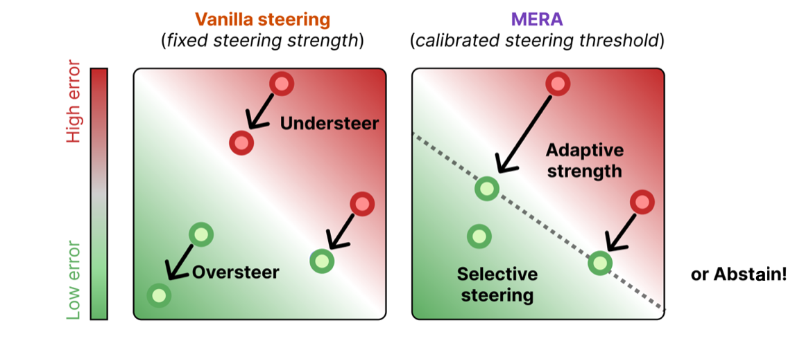

<br/><br/>
<p align="center">
  
<h3 align="center"><b>Inference-time Steering for Language Models</b></h3>
<p align="center">PyTorch</p>
<br/><br/>

This repository contains the code and experiments for the paper **["To Steer or Not to Steer? Mechanistic Error Reduction with Abstention for Language Models"]([Link](https://openreview.net/pdf?id=ukLxqA8zXj))** by Hedström et al., (2025).

[](anonymous)

[](https://github.com/psf/black)
<!--[](https://badge.fury.io/py/metaquantus)-->
<!--[](https://github.com/annahedstroem/MetaQuantus/actions/workflows/python-publish.yml/badge.svg)-->
<!--[](anonymous)-->

Please note that this repository is under active development!
<!--
## Citation

If you find this work interesting or useful in your research, use the following Bibtex annotation to cite us:

```bibtex
@article{mera2025steering,
    title={To Steer or Not to Steer? Mechanistic Error Reduction with Abstention for Language Models},
    author={},
    journal={},
    year={},
    url={},
}
```
-->
<!--This work has been published ...........-->

## Repository overview

The repository is organised as follows:
- The `src/` folder contains all necessary functions.
- The `nbs/` folder includes notebooks for generating the plots in the paper and for benchmarking experiments.
- The `tests/` folder contains the tests.
<!--- The `assets/` folder contains all files to reproduce the experiments.-->

## Paper highlights 📚

Our approach consists of three main steps. First, we use linear probes to obtain an effective direction for minimising the predicted error. Second, this direction is then scaled using the closed-form solution at both the token and layer levels. Third, we calibrate the steering threshold against the true error on the calibration dataset, informed by the user's tolerance for uncertainty.
</p>
<p align="center">
   
</p>

The main benefits of MERA includes:
- **Selective steering** — at token position and layer-level, we steer only if p̂(h) > α
- **Adaptive strength** — intervention scales with the predicted errorλ ∝ p̂(h)
- **Global abstention** — steer only if when confident, such that performance is at least ε with probability 1-δ

## Installation

Install the necessary packages using the provided [requirements.txt](https://github.com/annahedstroem/MERA-steering/blob/main/requirements.txt):

```bash
conda init
pip install -r requirements.txt
pip install -e git+https://github.com/jbloomAus/SAELens.git#egg=SAELens
pip install transformers datasets accelerate huggingface_hub
```

## Package requirements 

Required packages are:

```setup
python>=3.10.1
torch>=2.0.0
transformers
datasets
huggingface_hub
accelerate
wandb
```

## Getting started

If you want to try using MERA with your own dataset and model, go to the following notebook `nbs/getting_started.py`.

To steer with MERA on any of the existing datasets and models (see supported datasets and models [here](#supported-models-and-datasets))., run the following script
```bash
python mera.py --task_names yes_no_question --model_name google/gemma-2-2b
```

## How to reproduce experimental results

In the following, we describe how to reproduce the results in the paper. It requires access to wandb (and that you pass your API [key](https://docs.wandb.ai/support/find_api_key/) and that datasets are downloaded and saved to root `.hf_cache` folder [here](#how-to-download-datasets)). 

Create a  `runs/` folder at root and go to `src/` folder.

```bash
mkdir runs/
cd src
```

<details> <summary><b>Step 1.</b> Prepare datasets for probe training</summary>
<br>
For each model, to prepare datasets for probe training (see supported datasets and models [here](#supported-models-and-datasets)) run the following script 
  
```bash
python -m cache.cache_run --task_names sentiment_analysis yes_no_question mmlu_high_school sms_spam --nr_samples 3000 --model_name meta-llama/Llama-3.2-1B-Instruct --hf_token INSERT_KEY
```
Just rerun with the different models (see supported datasets and models [here](#supported-models-and-datasets)).

Next, post-processes the cache data (i.e., subselect activation values based on token positions ("last" of the prompt and "exact" of the answer)), making the cached files significantly smaller in size in preparation for probe training.
```bash
python -m cache.cache_postprocess --task_names sentiment_analysis yes_no_question mmlu_high_school sms_spam
```
</details>

<details> <summary><b>Step 2.</b> Train linear probes</summary>
<br>
  For each model, to train linear probes (error estimators), run the following script
```bash
python -m probes.probes_train --task_names sentiment_analysis yes_no_question mmlu_high_school sms_spam --model_name meta-llama/Llama-3.2-1B-Instruct --save_name trial --process_saes False
```
if you want to change any of the hyperparameters, please edit the script `probes_train.py` directly.

To analyse the performance of the probes, go to the following notebook `nbs/evaluate_probes.py`.
</details>

<details> <summary><b>Step 3.</b> Benchmark steering methods</summary>
<br>
  For each model, to benchmark steering methods, run the following script
```bash
python -m steering.steering_run --steering_methods optimal_probe --task_names sms_spam --model_names "meta-llama/Llama-3.2-1B-Instruct" --fname custom_experiment --probe_token_pos exact --wandb_key INSERT_KEY
```
To analyse the performance of the steering methods, go to the following notebook `nbs/evaluate_steering.py`.
</details>

## Dataset and models

#### How to download datasets

To download the datasets, please follow the instructions [here](src/how-to-download-datasets.md). If you want to include additional datasets, please see the following guide [here](src/how-extend-datasets.md)).

#### Supported datasets and models

Currently, we support these datasets
- `sentiment_analysis`
- `yes_no_question`
- `mmlu_high_school`
- `sms_spam`

Our experiments currenly work with these models
- `google/gemma-2-2b`
- `google/gemma-2-2b-it`
- `Qwen/Qwen2.5-3B`
- `Qwen/Qwen2.5-3B-Instruct`
- `meta-llama/Llama-3.2-1B`
- `meta-llama/Llama-3.2-1B-Instruct`

These models are chosen based on compatibility with our current implementation, which assumes a decoder-only architecture with blocks containing a residual stream.

### Thank you

We hope our repository is beneficial to your work and research. If you have any feedback, questions, or ideas, please feel free to raise an issue in this repository. Alternatively, you can reach out to us directly via email for discussions or suggestions. 

📧 Contact us: 
- Anna Hedström: [hedstroem.anna@gmail.com](mailto:hedstroem.anna@gmail.com)
- Salim Amoukou: [salimamoukou@gmail.com](mailto:salimamoukou@gmail.com)

Thank you for your interest and support!


